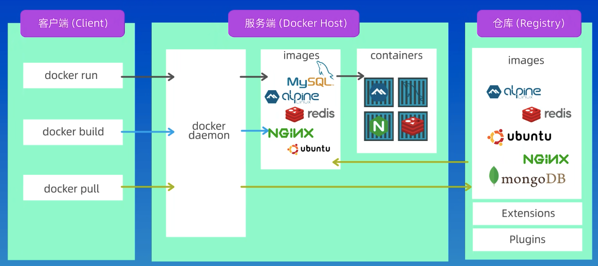
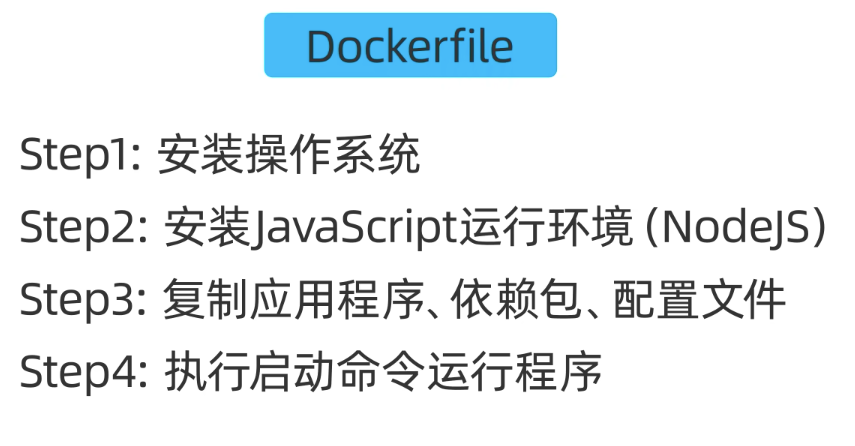

# docker学习笔记

Docker是一个用于  构建 运行 传送   的应用程序的平台
               build run share



```shell
MacBook-Air:~ xuyaochen$ docker version
Client:
 Version:           29.1.3
 API version:       1.52
 Go version:        go1.25.5
 Git commit:        f52814d
 Built:             Fri Dec 12 14:48:46 2025
 OS/Arch:           darwin/amd64
 Context:           desktop-linux

Server: Docker Desktop 4.57.0 (215387)
 Engine:
  Version:          29.1.3
  API version:      1.52 (minimum version 1.44)
  Go version:       go1.25.5
  Git commit:       fbf3ed2
  Built:            Fri Dec 12 14:49:51 2025
  OS/Arch:          linux/amd64
  Experimental:     false
 containerd:
  Version:          v2.2.1
  GitCommit:        dea7da592f5d1d2b7755e3a161be07f43fad8f75
 runc:
  Version:          1.3.4
  GitCommit:        v1.3.4-0-gd6d73eb8
 docker-init:
  Version:          0.19.0
  GitCommit:        de40ad0
MacBook-Air:~ xuyaochen$ 
```




FROM node:14-alpine

alipine 类似 centos 是一种linux发行版


FROM node:14-alpine
COPY index.js /index.js
CMD [ "node", "/index.js" ]


终端运行
MacBook-Air:HelloDocker xuyaochen$ docker build -t hello-docer .

docker desktop这里的 docker image 配置

```json
{
  "builder": {
    "gc": {
      "defaultKeepStorage": "20GB",
      "enabled": true
    }
  },
  "experimental": false,
  "registry-mirrors": [
    "https://docker.1ms.run"
  ]
}
```

```shell
MacBook-Air:HelloDocker xuyaochen$ docker image ls
                                                                                                                                  i Info →   U  In Use
IMAGE                ID             DISK USAGE   CONTENT SIZE   EXTRA
hello-docer:latest   30344bba8dcb        180MB         42.9MB        
MacBook-Air:HelloDocker xuyaochen$ docker images
                                                                                                                                  i Info →   U  In Use
IMAGE                ID             DISK USAGE   CONTENT SIZE   EXTRA
hello-docer:latest   30344bba8dcb        180MB         42.9MB        
MacBook-Air:HelloDocker xuyaochen$ 
```

MacBook-Air:HelloDocker xuyaochen$ docker run hello-docer
Hello, xyc

有个网站可以学习使用：

https://labs.play-with-docker.com/