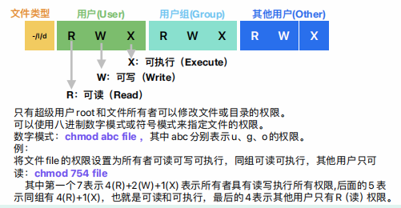

#linux相关命令

multipass launch --name ubuntu --cpus 2 --memory 4G --disk 5G

multipass list

multipass shell ubuntu

exit

MacBook-Air:~ xuyaochen$ multipass ls
Name                    State             IPv4             Image
primary                 Running           192.168.64.3     Ubuntu 24.04 LTS
ubuntu                  Running           192.168.64.2     Ubuntu 24.04 LTS
MacBook-Air:~ xuyaochen$ multipass delete primary
MacBook-Air:~ xuyaochen$ multipass ls
Name                    State             IPv4             Image
primary                 Deleted           --               Ubuntu 24.04 LTS
ubuntu                  Running           192.168.64.2     Ubuntu 24.04 LTS
MacBook-Air:~ xuyaochen$ 

multipass purge 清理已经删除的虚拟机实例

# vi/vim编辑器

:help

Last login: Sat Jan 10 12:47:01 on console

The default interactive shell is now zsh.
To update your account to use zsh, please run `chsh -s /bin/zsh`.
For more details, please visit https://support.apple.com/kb/HT208050.
MacBook-Air:~ xuyaochen$ multipass
Usage: multipass [options] <command>
Create, control and connect to Ubuntu instances.

This is a command line utility for multipass, a
service that manages Ubuntu instances.

Options:
  -h, --help     Displays help on commandline options
  -v, --verbose  Increase logging verbosity. Repeat the 'v' in the short option
                 for more detail. Maximum verbosity is obtained with 4 (or more)
                 v's, i.e. -vvvv.

Available commands:
  alias         Create an alias
  aliases       List available aliases
  authenticate  Authenticate client
  clone         Clone an instance
  delete        Delete instances and snapshots
  exec          Run a command on an instance
  find          Display available images to create instances from
  get           Get a configuration setting
  help          Display help about a command
  info          Display information about instances or snapshots
  launch        Create and start an Ubuntu instance
  list          List all available instances or snapshots
  mount         Mount a local directory in the instance
  networks      List available network interfaces
  prefer        Switch the current alias context
  purge         Purge all deleted instances permanently
  recover       Recover deleted instances
  restart       Restart instances
  restore       Restore an instance from a snapshot
  set           Set a configuration setting
  shell         Open a shell on an instance
  snapshot      Take a snapshot of an instance
  start         Start instances
  stop          Stop running instances
  suspend       Suspend running instances
  transfer      Transfer files between the host and instances
  umount        Unmount a directory from an instance
  unalias       Remove aliases
  version       Show version details
MacBook-Air:~ xuyaochen$ multipass multipass launch --name ubuntu --cpus 2 --memory 4G --disk 5G
Error: Unknown command or alias 'multipass' (try "multipass help" or "multipass aliases")
MacBook-Air:~ xuyaochen$ multipass launch
Retrieving image: 65%^C
MacBook-Air:~ xuyaochen$ multipass launch --name ubuntu --cpus 2 --memory 4G --disk 5G
Launched: ubuntu
MacBook-Air:~ xuyaochen$ multipass list
Name                    State             IPv4             Image
ubuntu                  Running           192.168.64.2     Ubuntu 24.04 LTS
MacBook-Air:~ xuyaochen$ multipass shell
Starting primary |^C
MacBook-Air:~ xuyaochen$ multipass shell ubuntu
Welcome to Ubuntu 24.04.3 LTS (GNU/Linux 6.8.0-90-generic x86_64)

 * Documentation:  https://help.ubuntu.com
 * Management:     https://landscape.canonical.com
 * Support:        https://ubuntu.com/pro

 System information as of Mon Jan 12 16:22:18 CST 2026

  System load:           0.03
  Usage of /:            49.0% of 3.80GB
  Memory usage:          4%
  Swap usage:            0%
  Processes:             112
  Users logged in:       0
  IPv4 address for ens3: 192.168.64.2
  IPv6 address for ens3: fdcf:a431:d30e:6cf9:5054:ff:fe18:10d7

Expanded Security Maintenance for Applications is not enabled.

48 updates can be applied immediately.
21 of these updates are standard security updates.
To see these additional updates run: apt list --upgradable

Enable ESM Apps to receive additional future security updates.
See https://ubuntu.com/esm or run: sudo pro status

To run a command as administrator (user "root"), use "sudo <command>".
See "man sudo_root" for details.

ubuntu@ubuntu:~$ exit
logout
MacBook-Air:~ xuyaochen$ multipass ls
Name                    State             IPv4             Image
primary                 Running           192.168.64.3     Ubuntu 24.04 LTS
ubuntu                  Running           192.168.64.2     Ubuntu 24.04 LTS
MacBook-Air:~ xuyaochen$ multipass delete primary
MacBook-Air:~ xuyaochen$ multipass ls
Name                    State             IPv4             Image
primary                 Deleted           --               Ubuntu 24.04 LTS
ubuntu                  Running           192.168.64.2     Ubuntu 24.04 LTS
MacBook-Air:~ xuyaochen$ multipass ls
Name                    State             IPv4             Image
primary                 Deleted           --               Ubuntu 24.04 LTS
ubuntu                  Running           192.168.64.2     Ubuntu 24.04 LTS
MacBook-Air:~ xuyaochen$ multipass purge
MacBook-Air:~ xuyaochen$ multipass ls
Name                    State             IPv4             Image
ubuntu                  Running           192.168.64.2     Ubuntu 24.04 LTS
MacBook-Air:~ xuyaochen$ multipass start unbuntu
start failed: instance(s) missing
Instance 'unbuntu' does not exist.

MacBook-Air:~ xuyaochen$ multipass start ubuntu
MacBook-Air:~ xuyaochen$ multipass ls 
Name                    State             IPv4             Image
ubuntu                  Running           192.168.64.2     Ubuntu 24.04 LTS
MacBook-Air:~ xuyaochen$ multipass shell ubuntu
Welcome to Ubuntu 24.04.3 LTS (GNU/Linux 6.8.0-90-generic x86_64)

 * Documentation:  https://help.ubuntu.com
 * Management:     https://landscape.canonical.com
 * Support:        https://ubuntu.com/pro

 System information as of Mon Jan 12 16:31:46 CST 2026

  System load:           0.01
  Usage of /:            49.0% of 3.80GB
  Memory usage:          4%
  Swap usage:            0%
  Processes:             106
  Users logged in:       0
  IPv4 address for ens3: 192.168.64.2
  IPv6 address for ens3: fdcf:a431:d30e:6cf9:5054:ff:fe18:10d7

Expanded Security Maintenance for Applications is not enabled.

48 updates can be applied immediately.
21 of these updates are standard security updates.
To see these additional updates run: apt list --upgradable

Enable ESM Apps to receive additional future security updates.
See https://ubuntu.com/esm or run: sudo pro status

Last login: Mon Jan 12 16:22:19 2026 from 192.168.64.1
To run a command as administrator (user "root"), use "sudo <command>".
See "man sudo_root" for details.

ubuntu@ubuntu:~$ vim

help.txt        For Vim version 9.1.  Last change: 2022 Dec 03

                        VIM - main help file
                                                                         k
      Move around:  Use the cursor keys, or "h" to go left,            h   l
                    "j" to go down, "k" to go up, "l" to go right.       j
Close this window:  Use ":q<Enter>".
   Get out of Vim:  Use ":qa!<Enter>" (careful, all changes are lost!).

Jump to a subject:  Position the cursor on a tag (e.g. bars) and hit CTRL-].
   With the mouse:  ":set mouse=a" to enable the mouse (in xterm or GUI).
                    Double-click the left mouse button on a tag, e.g. bars.
        Jump back:  Type CTRL-O.  Repeat to go further back.

Get specific help:  It is possible to go directly to whatever you want help
                    on, by giving an argument to the :help command.
                    Prepend something to specify the context:  help-context

                          WHAT                  PREPEND    EXAMPLE
                      Normal mode command                  :help x
help.txt [Help][RO]                                           13,1-8         Top

[No Name]                                                     0,0-1          All
"help.txt" [readonly] 253L, 9491B                                       

vi hello.txt

yy

p

dd

:set number

:set nu

gg 跳转到文件第一行

100G 表示跳转到文件的第100行

/hello

?hello

n 表示 next

/hello\c

:1,5s/hello/world/g

u 撤销

vi .vimrc 保存vi的配置信息

# 常用命令

ls 显示目录内容

ls -ltr

ubuntu@ubuntu:/$ ls -ltr
total 76
drwxr-xr-x   2 root root  4096 Feb 26  2024 bin.usr-is-merged
drwxr-xr-x   2 root root  4096 Mar 31  2024 sbin.usr-is-merged
drwxr-xr-x   2 root root  4096 Apr  8  2024 lib.usr-is-merged

创建一个软链接

ln -s hello.txt  link.txt

ls -ltr

ubuntu@ubuntu:~$ ls -ltr
total 4
-rw-rw-r-- 1 ubuntu ubuntu 358 Jan 13 10:46 hello.txt
lrwxrwxrwx 1 ubuntu ubuntu   9 Jan 13 11:04 link.txt -> hello.txt
ubuntu@ubuntu:~$ 

inode (index node) 
◎ 文件类型：例如, 是一个普通文件、目录还是链接。
◎ 权限：文件的访问权限, 如读、写和执行权限。
◎ 所有者：文件的拥有者和组信息。
◎ 文件大小：文件的大小 (字节数) 。
◎ 时间戳：文件的创建时间、最后访问时间和最后修改时间。
◎ 数据块指针：指向实际存储文件数据的磁盘块的指针。

echo "hello xyc"> file2.txt 
将echo中的内容 重定向到 txt文件当中

ubuntu@ubuntu:~$ ls -ltri
total 12
262445 -rw-rw-r-- 1 ubuntu ubuntu 358 Jan 13 10:46 hello.txt
262196 lrwxrwxrwx 1 ubuntu ubuntu   9 Jan 13 11:04 link.txt -> hello.txt
262225 -rw-rw-r-- 2 ubuntu ubuntu  10 Jan 13 11:11 hardlink.txt
262225 -rw-rw-r-- 2 ubuntu ubuntu  10 Jan 13 11:11 file2.txt
ubuntu@ubuntu:~$ 

i 表示 i结点

rm file2.txt 

-rw-rw-r-- 1 ubuntu ubuntu 358 Jan 13 10:46 hello.txt
lrwxrwxrwx 1 ubuntu ubuntu   9 Jan 13 11:04 link.txt -> hello.txt
-rw-rw-r-- 1 ubuntu ubuntu  21 Jan 13 11:13 hardlink.txt

-rw-rw-r--
第一个字符
  -/l/d

  
  -表示普通文件
  l表示符号链接
  d表示目录

  用户的权限  用户组的权限  其他用户的权限 
- rw-       rw-         r--

r表示可读
w表示可写
x表示可执行

相应的位置上如果没有权限 则显示 -

chmod 命令 表示 change mode 修改权限 

chmod +x 表示添加可执行权限

chmod +x hello.txt

ubuntu@ubuntu:~$ chmod ug+x hello.txt 
ubuntu@ubuntu:~$ ls -ltr
total 8
-rwxrwxr-- 1 ubuntu ubuntu 358 Jan 13 10:46 hello.txt
lrwxrwxrwx 1 ubuntu ubuntu   9 Jan 13 11:04 link.txt -> hello.txt
-rw-rw-r-- 1 ubuntu ubuntu  21 Jan 13 11:13 hardlink.txt
ubuntu@ubuntu:~$ 

chmod ug+x hello.txt 
给用户 和 用户组 添加 可执行的权限  
|rwx|rwx|rwx|
|:--:|:--:|:--:|
|421|421|421|

chmod 777 hello.txt

echo "hello" 输出回显

echo "hello" > hello.txt

  ">"表示一个 重定向符号

  例： 在当前目录下查找所有java源文件中的字符串context：
 find. -type f -name "*.java" | xargs grep -i -n "context

 find. -type f -name "*.java" | xargs grep -i -n "context"

 bin目录存放的是系统的基本命令
 以及一些二进制的可执行文件

 /etc下面存放的是 和系统 和软件相关的配置文件

 

 du  查看文件大小

 ubuntu@ubuntu:~$ du -a
4	./xyc01.txt
4	./hardlink.txt
0	./link.txt
4	./hello.txt
4	./.bash_logout
4	./.bash_history
0	./.cache/motd.legal-displayed
4	./.cache
4	./.ssh/authorized_keys
8	./.ssh
8	./.viminfo
4	./.profile
4	./.bashrc
52	.
ubuntu@ubuntu:~$ 

ubuntu@ubuntu:~$ tree
.
├── hardlink.txt
├── hello.txt
├── link.txt -> hello.txt
└── xyc01.txt

1 directory, 4 files
ubuntu@ubuntu:~$ 