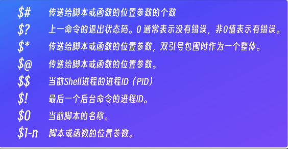
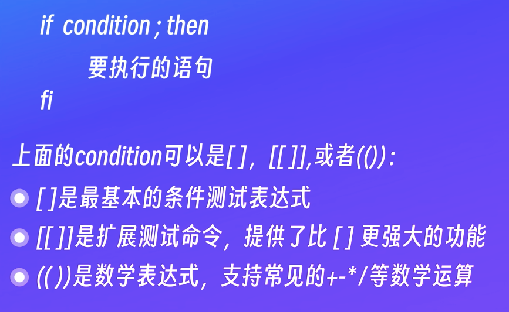

# shell 相关内容学习


ubuntu@ubuntu:~$ cat /etc/shells 
# /etc/shells: valid login shells
/bin/sh
/usr/bin/sh
/bin/bash
/usr/bin/bash
/bin/rbash
/usr/bin/rbash
/usr/bin/dash
/usr/bin/screen
/usr/bin/tmux
ubuntu@ubuntu:~$ 

上面这个文件 记录了所有的shell版本


ubuntu@ubuntu:~$ echo $HOME
/home/ubuntu
ubuntu@ubuntu:~$ echo $PATH
/usr/local/sbin:/usr/local/bin:/usr/sbin:/usr/bin:/sbin:/bin:/usr/games:/usr/local/games:/snap/bin
ubuntu@ubuntu:~$ 


ubuntu@ubuntu:~$ echo $SHELL
/bin/bash

echo $0 用来查看当前正在执行的脚本的名称

# shell 脚本

安装软件 备份数据 系统的运维巡检


chmod 777 hello.sh

ubuntu@ubuntu:~$ ls -ltr
total 16
-rwxrwxrwx 1 ubuntu ubuntu 358 Jan 13 10:46 hello.txt
lrwxrwxrwx 1 ubuntu ubuntu   9 Jan 13 11:04 link.txt -> hello.txt
-rw-rw-r-- 1 ubuntu ubuntu  21 Jan 13 11:13 hardlink.txt
-rwxrwxr-x 1 ubuntu ubuntu 358 Jan 13 11:47 xyc01.txt
-rwxrwxrwx 1 ubuntu ubuntu  47 Jan 15 14:44 hello.sh


ubuntu@ubuntu:~$ ./hello.sh 
hello shell：
Thu Jan 15 14:45:03 CST 2026
ubuntu
ubuntu@ubuntu:~$ 


## 本地启动的ubuntu 如何 用vscode的 remotessh去连接

sudo apt update
sudo apt install -y openssh-server

sudo systemctl start ssh
sudo systemctl enable ssh
sudo systemctl status ssh


ip a

inet 192.168.64.2

whoami
ubuntu

ssh ubuntu@192.168.64.2


MacBook-Air:git-demo xuyaochen$ ssh ubuntu@192.168.64.2
ubuntu@192.168.64.2: **Permission denied** (publickey).
MacBook-Air:git-demo xuyaochen$ 

很好，这个输出已经100%确定问题点了，我们可以直接“对症下药”，不用再猜 👌

你现在的状态是：

✅ 网络是通的（能连到 192.168.64.2）

❌ Ubuntu 的 SSH 只允许公钥登录

❌ 用户 ubuntu 的 authorized_keys 里没有你的公钥


ls ~/.ssh/id_ed25519.pub


ssh-keygen -t ed25519 -C "mac-vscode"


[对应的解决方案](https://chatgpt.com/share/69689922-70e4-8009-83c5-d95a860f6571)


#!/bin/bash

echo "请输入姓名："
read name
echo "您好，$name"


ubuntu@ubuntu:~$ bash game.sh 
请输入姓名：
xuycd
您好，xuycd
ubuntu@ubuntu:~$ 


chmod +x game.sh 

+x 相当于添加了可执行文件的权限

核心问题 1：变量赋值不能有空格

> Bash 里变量赋值：等号左右绝对不能有空格

```bash
#!/bin/bash

echo "请输入姓名："
#read name
name=$1
channel=$2
echo "您好，$name,欢迎来到$channel !"


```

ubuntu@ubuntu:~$ bash game.sh xsdf 23
请输入姓名：
您好，xsdf,欢迎来到23 !
ubuntu@ubuntu:~$ 


$相关的用法


export命令 可以把普通变量赋值为环境变量

```
ubuntu@ubuntu:~$ export name=徐耀晨
ubuntu@ubuntu:~$ export channel=xyc0833
ubuntu@ubuntu:~$ ./game.sh 
请输入姓名：
您好，徐耀晨,欢迎来到xyc0833 !
ubuntu@ubuntu:~$ 
```

ls -a
表示显示所有文件  会显示隐藏文件
.profile文件在用户登录的时候执行 且 只执行一次
.bashrc文件 在每次新打开一个终端 或者新建一个shell会话的时候 执行

修改完成之后 

source .bashrc 表示重新加载这个文件


ubuntu@ubuntu:~$ shuf -i 1-10
6
10
5
8
4
3
7
2
1
9
ubuntu@ubuntu:~$ 

ubuntu@ubuntu:~$ shuf -i 1-10 -n 1

-n 1 表示生成1个

```bash

#!/bin/bash

echo "请输入姓名："
#read name
#name=$1
#channel=$2
echo "您好，$name,欢迎来到$channel !"
number=$(shuf -i 1-10 -n 1)
echo $number

```





#!/bin/bash

echo "请输入姓名："
#read name
#name=$1
#channel=$2
echo "您好，$name,欢迎来到$channel !"
number=$(shuf -i 1-10 -n 1)
echo $number
echo "请输入一个1-10之间的数字"
read guess
if [[ $guess -eq $number  ]]; then
        echo "猜对了"
elif [[ $guess -lt $number ]]; then
        echo "猜小了"
else
        echo "猜大了"
fi


!/bin/bash

echo "请输入姓名："
#read name
#name=$1
#channel=$2
echo "您好，$name,欢迎来到$channel !"

number=$(shuf -i 1-10 -n 1)
echo $number
while  [[ $guess -ne $number ]]
do
echo "请输入一个1-10之间的数字"
read guess
if [[ $guess -eq $number  ]]; then
        echo "猜对了"
elif [[ $guess -lt $number ]]; then
        echo "猜小了"
else
        echo "猜大了"
fi
done

echo $((RANDOM % 10 + 1))


echo "请输入姓名："
#read name
#name=$1
#channel=$2
echo "您好，$name,欢迎来到$channel !"

number=$(shuf -i 1-10 -n 1)
echo $number
while true
do
echo "请输入一个1-10之间的数字"
read guess
if [[ $guess -eq $number  ]]; then
        echo "恭喜你猜对了 是否继续（y/n）:"
        read choice
        if [[ $choice == "y" ]]; then
                number=$((RANDOM % 10 + 1)) 
                echo $number 
                continue
        else
                break
        fi
elif [[ $guess -lt $number ]]; then
        echo "猜小了"
else
        echo "猜大了"
fi
done