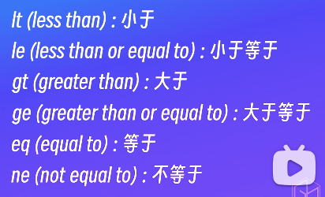

# shell 相关内容学习

ubuntu@ubuntu:~$ cat /etc/shells 
# /etc/shells: valid login shells
/bin/sh
/usr/bin/sh
/bin/bash
/usr/bin/bash
/bin/rbash
/usr/bin/rbash
/usr/bin/dash
/usr/bin/screen
/usr/bin/tmux
ubuntu@ubuntu:~$ 

上面这个文件 记录了所有的shell版本

ubuntu@ubuntu:~$ echo $HOME
/home/ubuntu
ubuntu@ubuntu:~$ echo $PATH
/usr/local/sbin:/usr/local/bin:/usr/sbin:/usr/bin:/sbin:/bin:/usr/games:/usr/local/games:/snap/bin
ubuntu@ubuntu:~$ 

ubuntu@ubuntu:~$ echo $SHELL
/bin/bash

echo $0 用来查看当前正在执行的脚本的名称

# shell 脚本

安装软件 备份数据 系统的运维巡检

chmod 777 hello.sh

ubuntu@ubuntu:~$ ls -ltr
total 16
-rwxrwxrwx 1 ubuntu ubuntu 358 Jan 13 10:46 hello.txt
lrwxrwxrwx 1 ubuntu ubuntu   9 Jan 13 11:04 link.txt -> hello.txt
-rw-rw-r-- 1 ubuntu ubuntu  21 Jan 13 11:13 hardlink.txt
-rwxrwxr-x 1 ubuntu ubuntu 358 Jan 13 11:47 xyc01.txt
-rwxrwxrwx 1 ubuntu ubuntu  47 Jan 15 14:44 hello.sh

ubuntu@ubuntu:~$ ./hello.sh 
hello shell：
Thu Jan 15 14:45:03 CST 2026
ubuntu
ubuntu@ubuntu:~$ 

